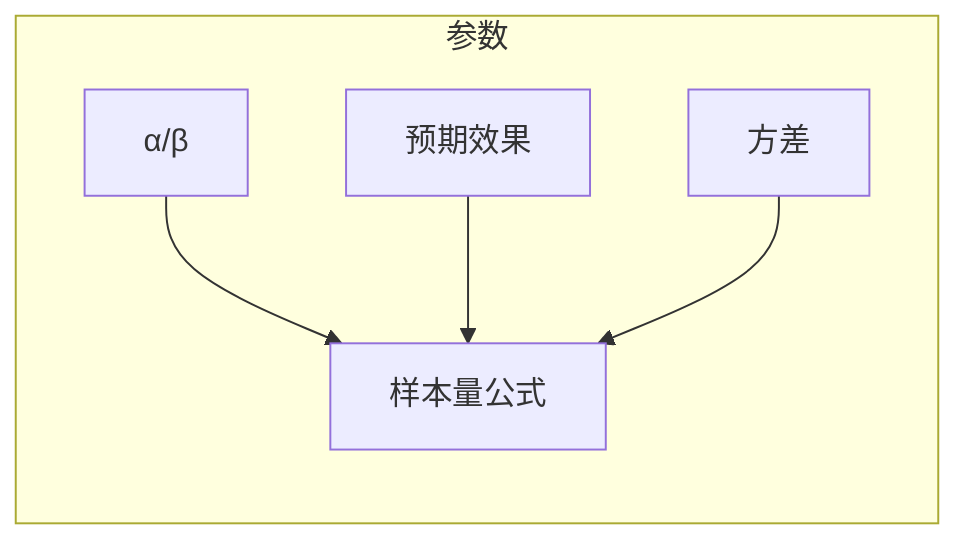
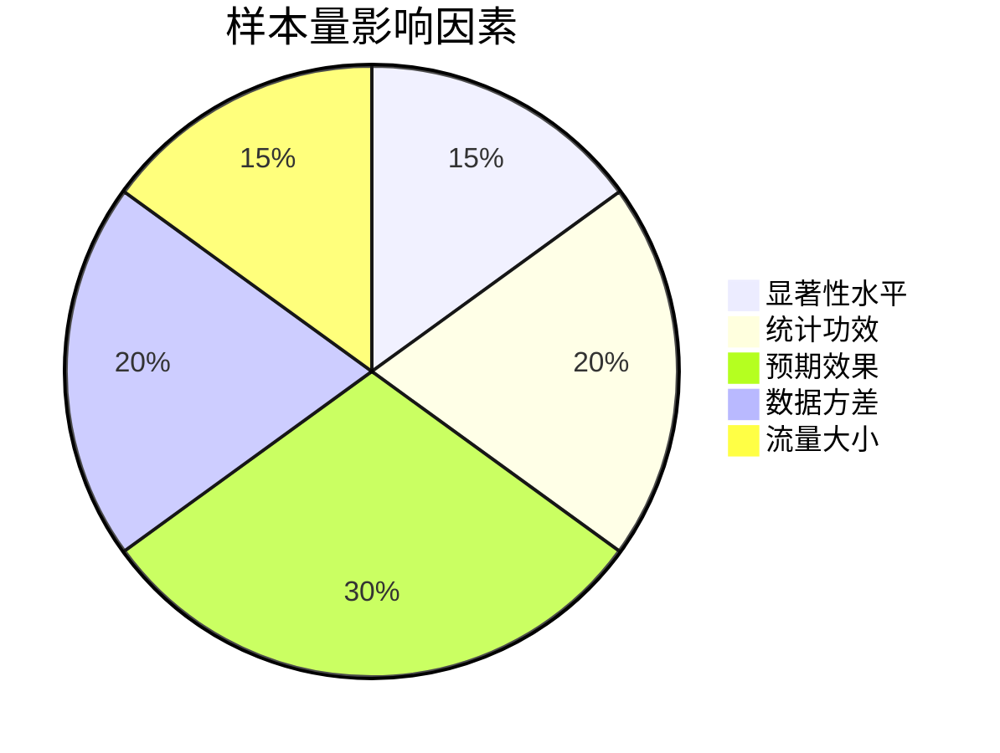

# 图8.34：样本量计算

## 计算公式

```mermaid
flowchart LR
    subgraph 参数
        A[α/β] --> D[样本量公式]
        B[预期效果] --> D
        C[方差] --> D
    end
```

## 影响因素

```mermaid
pie title 样本量影响因素
    "显著性水平" : 15
    "统计功效" : 20
    "预期效果" : 30
    "数据方差" : 20
    "流量大小" : 15
```
