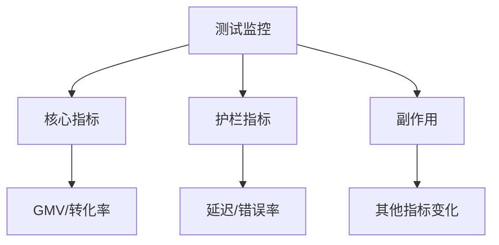
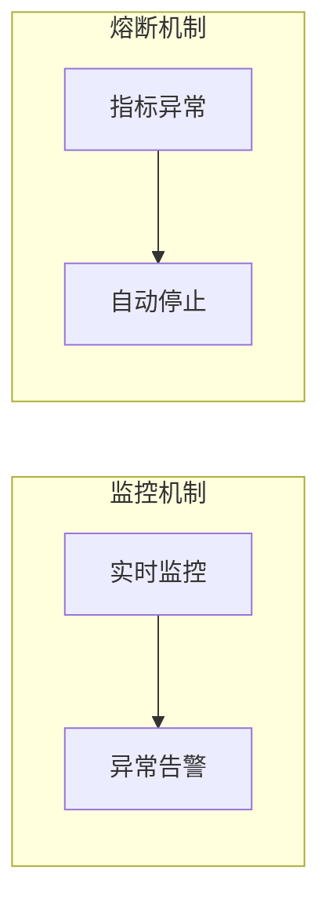

# 图8.35：A/B测试监控体系

## 监控指标

```mermaid
flowchart TD
    A[测试监控] --> B[核心指标]
    A --> C[护栏指标]
    A --> D[副作用]
    
    B --> B1[GMV/转化率]
    C --> C1[延迟/错误率]
    D --> D1[其他指标变化]
```

## 风险控制

```mermaid
flowchart LR
    subgraph 监控机制
        A[实时监控] --> D[异常告警]
    end
    
    subgraph 熔断机制
        B[指标异常] --> E[自动停止]
    end
```
