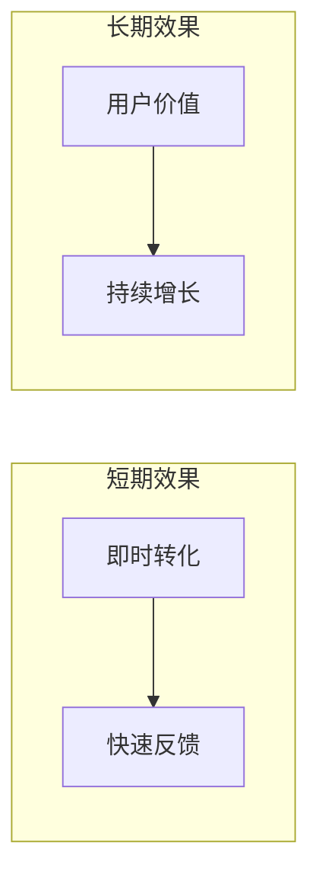
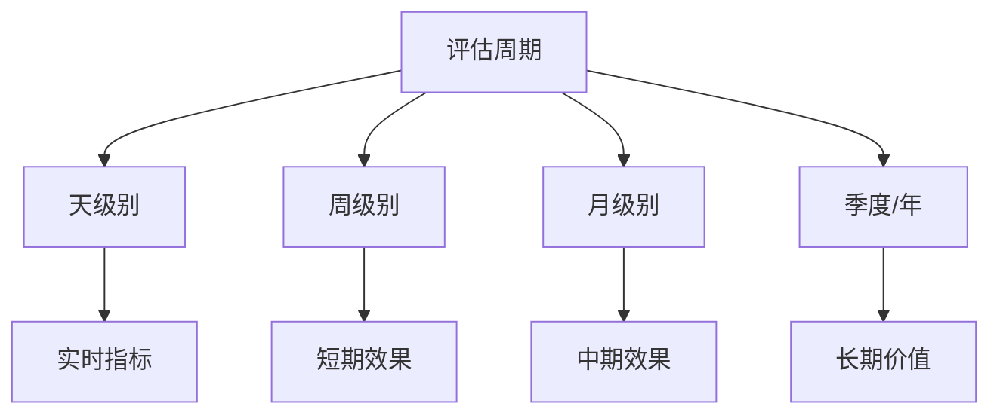

# 图8.36：长期效果评估——时间维度考量

## 短期vs长期

```mermaid
flowchart LR
    subgraph 短期效果
        A[即时转化] --> D[快速反馈]
    end
    
    subgraph 长期效果
        B[用户价值] --> E[持续增长]
    end
```

## 时间跨度

```mermaid
flowchart TD
    A[评估周期] --> B[天级别]
    A --> C[周级别]
    A --> D[月级别]
    A --> E[季度/年]
    
    B --> B1[实时指标]
    C --> C1[短期效果]
    D --> D1[中期效果]
    E --> E2[长期价值]
```
