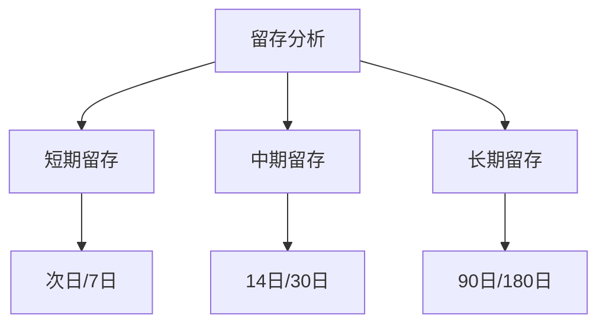
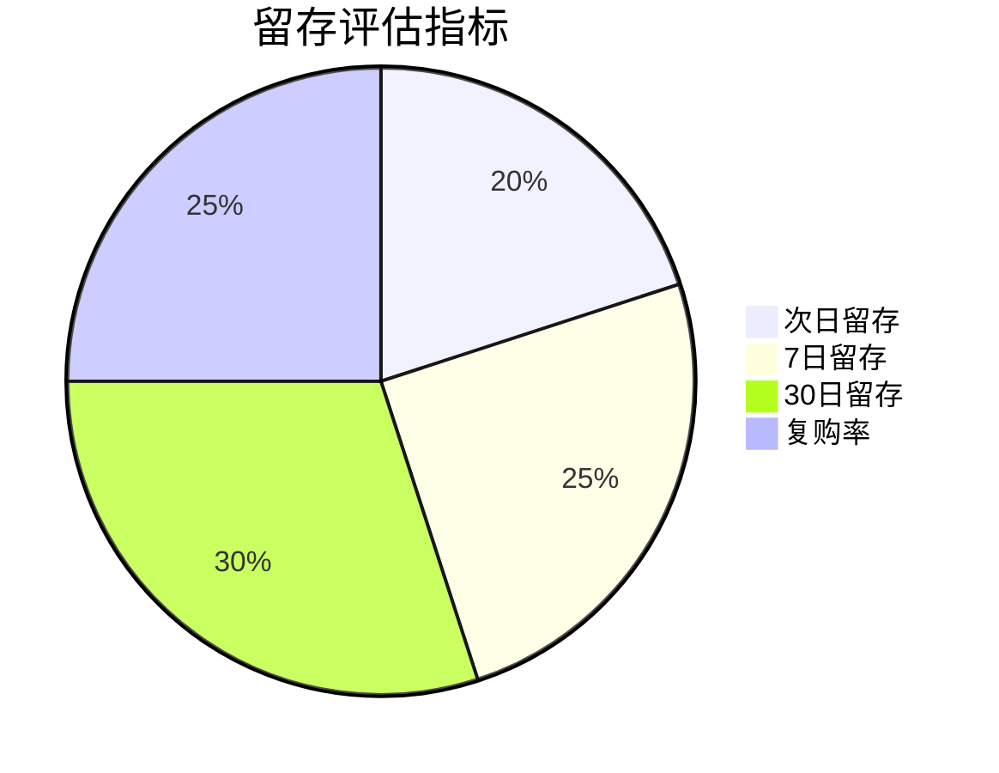

# 图8.37：用户留存评估

## 留存指标

```mermaid
flowchart TD
    A[留存分析] --> B[短期留存]
    A --> C[中期留存]
    A --> D[长期留存]
    
    B --> B1[次日/7日]
    C --> C1[14日/30日]
    D --> D1[90日/180日]
```

## 评估方法

```mermaid
pie title 留存评估指标
    "次日留存" : 20
    "7日留存" : 25
    "30日留存" : 30
    "复购率" : 25
```
