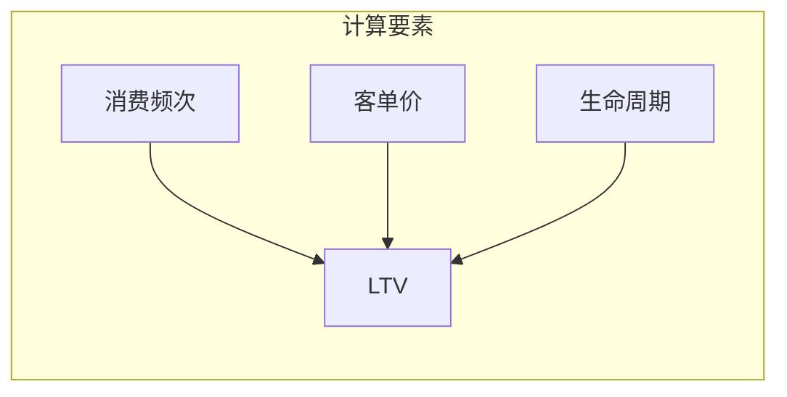
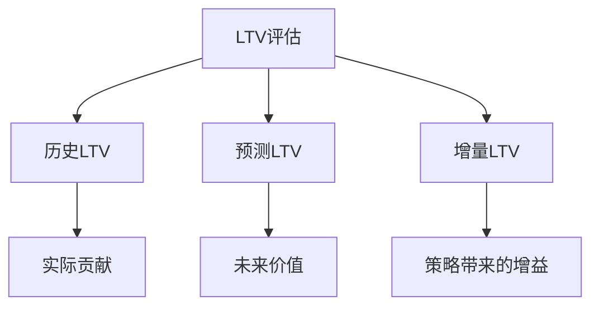

# 图8.38：用户生命周期价值评估

## LTV模型

```mermaid
flowchart LR
    subgraph 计算要素
        A[消费频次] --> D[LTV]
        B[客单价] --> D
        C[生命周期] --> D
    end
```

## 评估维度

```mermaid
flowchart TD
    A[LTV评估] --> B[历史LTV]
    A --> C[预测LTV]
    A --> D[增量LTV]
    
    B --> B1[实际贡献]
    C --> C1[未来价值]
    D --> D2[策略带来的增益]
```
