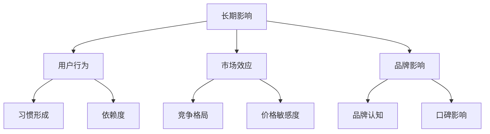
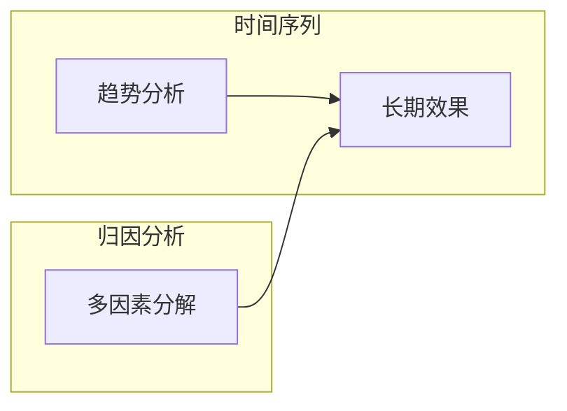

# 图8.39：长期影响分析

## 长期影响维度

```mermaid
flowchart TD
    A[长期影响] --> B[用户行为]
    A --> C[市场效应]
    A --> D[品牌影响]
    
    B --> B1[习惯形成]
    B --> B2[依赖度]
    
    C --> C1[竞争格局]
    C --> C2[价格敏感度]
    
    D --> D1[品牌认知]
    D --> D2[口碑影响]
```

## 分析方法

```mermaid
flowchart LR
    subgraph 时间序列
        A[趋势分析] --> D[长期效果]
    end
    
    subgraph 归因分析
        B[多因素分解] --> D
    end
```
