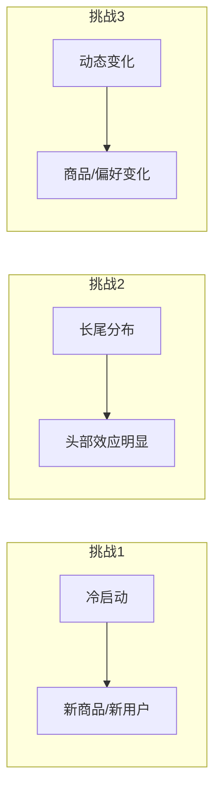
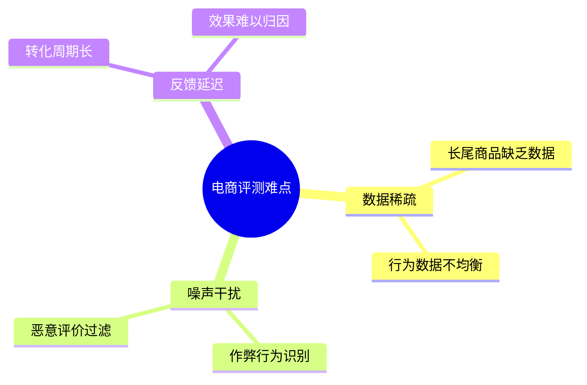

# 图8.3：电商评测数据挑战

## 核心挑战

```mermaid
flowchart LR
    subgraph 挑战1
        A[冷启动] --> D[新商品/新用户]
    end
    
    subgraph 挑战2
        B[长尾分布] --> E[头部效应明显]
    end
    
    subgraph 挑战3
        C[动态变化] --> F[商品/偏好变化]
    end
```

## 评测难点

```mermaid
mindmap
  root((电商评测难点))
    数据稀疏
      长尾商品缺乏数据
      行为数据不均衡
    噪声干扰
      作弊行为识别
      恶意评价过滤
    反馈延迟
      转化周期长
      效果难以归因
```
