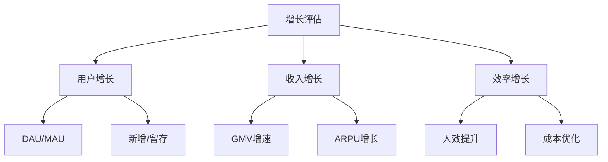
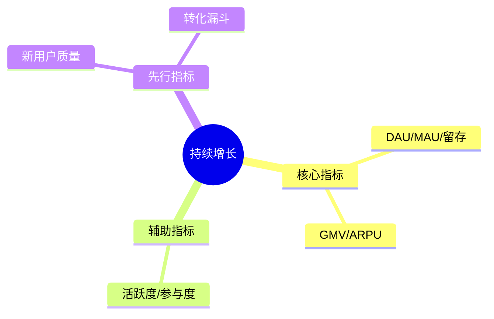

# 图8.40：持续增长评估框架

## 增长指标

```mermaid
flowchart TD
    A[增长评估] --> B[用户增长]
    A --> C[收入增长]
    A --> D[效率增长]
    
    B --> B1[DAU/MAU]
    B --> B2[新增/留存]
    
    C --> C1[GMV增速]
    C --> C2[ARPU增长]
    
    D --> D1[人效提升]
    D --> D2[成本优化]
```

## 评估体系

```mermaid
mindmap
  root((持续增长))
    核心指标
      DAU/MAU/留存
      GMV/ARPU
    辅助指标
      活跃度/参与度
    先行指标
      新用户质量
      转化漏斗
```
