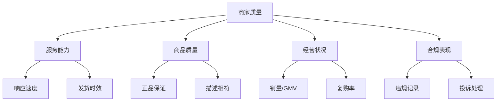

# 图8.41：商家质量评估体系

## 评估维度

```mermaid
flowchart TD
    A[商家质量] --> B[服务能力]
    A --> C[商品质量]
    A --> D[经营状况]
    A --> E[合规表现]
    
    B --> B1[响应速度]
    B --> B2[发货时效]
    
    C --> C1[正品保证]
    C --> C2[描述相符]
    
    D --> D1[销量/GMV]
    D --> D2[复购率]
    
    E --> E1[违规记录]
    E --> E2[投诉处理]
```
