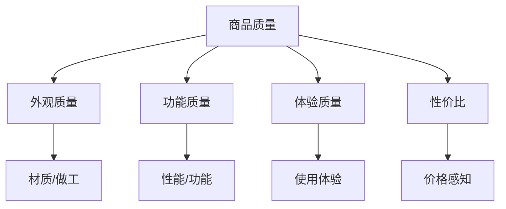
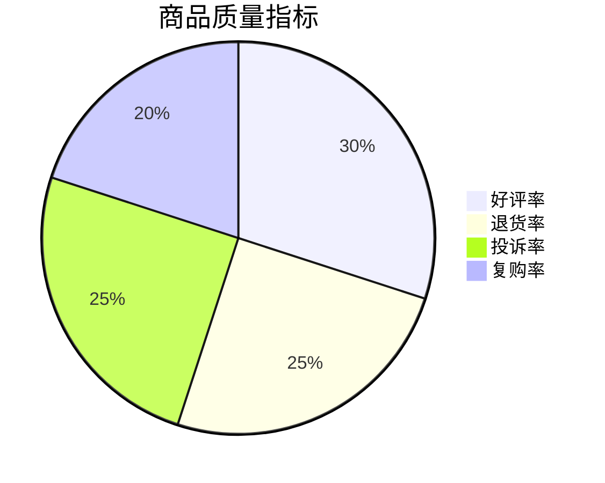

# 图8.42：商品质量评估

## 质量维度

```mermaid
flowchart TD
    A[商品质量] --> B[外观质量]
    A --> C[功能质量]
    A --> D[体验质量]
    A --> E[性价比]
    
    B --> B1[材质/做工]
    C --> C1[性能/功能]
    D --> D1[使用体验]
    E --> E1[价格感知]
```

## 评估方法

```mermaid
pie title 商品质量指标
    "好评率" : 30
    "退货率" : 25
    "投诉率" : 25
    "复购率" : 20
```
