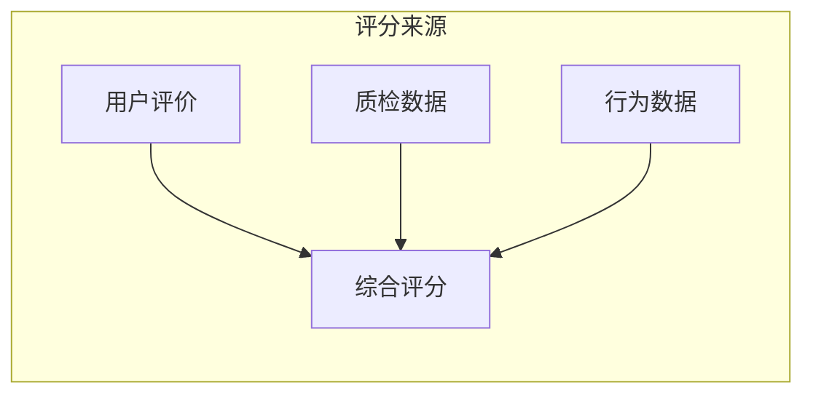
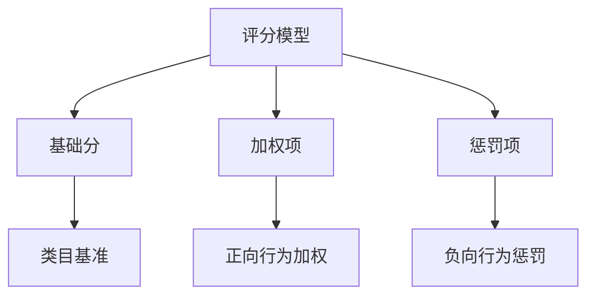

# 图8.43：质量评分模型

## 评分体系

```mermaid
flowchart LR
    subgraph 评分来源
        A[用户评价] --> D[综合评分]
        B[质检数据] --> D
        C[行为数据] --> D
    end
```

## 模型设计

```mermaid
flowchart TD
    A[评分模型] --> B[基础分]
    A --> C[加权项]
    A --> D[惩罚项]
    
    B --> B1[类目基准]
    C --> C1[正向行为加权]
    D --> D1[负向行为惩罚]
```
