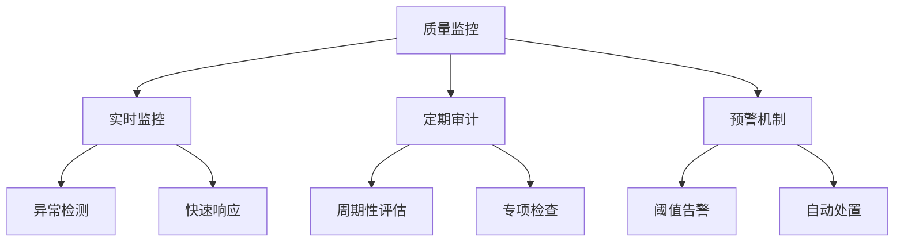
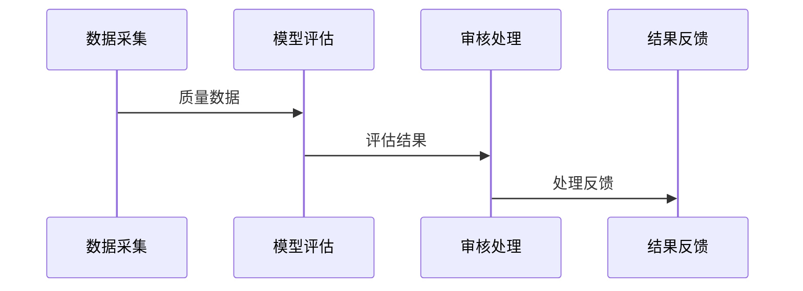

# 图8.44：质量监控体系

## 监控维度

```mermaid
flowchart TD
    A[质量监控] --> B[实时监控]
    A --> C[定期审计]
    A --> D[预警机制]
    
    B --> B1[异常检测]
    B --> B2[快速响应]
    
    C --> C1[周期性评估]
    C --> C2[专项检查]
    
    D --> D1[阈值告警]
    D --> D2[自动处置]
```

## 评估流程

```mermaid
sequenceDiagram
    participant D as 数据采集
    participant M as 模型评估
    participant A as 审核处理
    participant R as 结果反馈
    
    D->>M: 质量数据
    M->>A: 评估结果
    A->>R: 处理反馈
```
