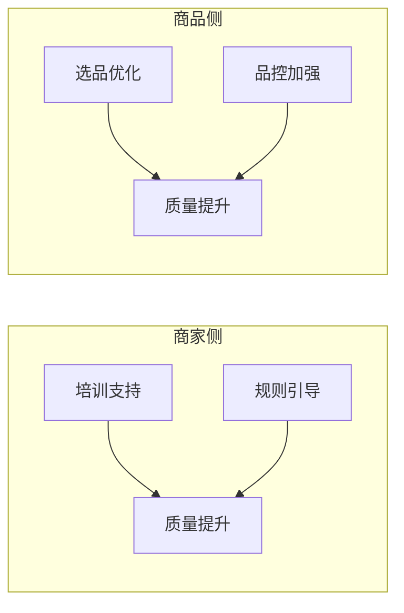
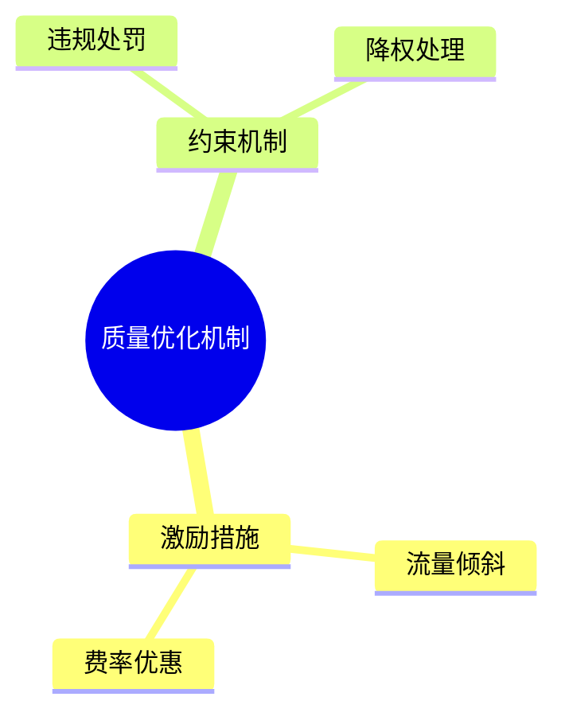

# 图8.45：质量优化策略

## 优化方向

```mermaid
flowchart LR
    subgraph 商家侧
        A[培训支持] --> D[质量提升]
        B[规则引导] --> D
    end
    
    subgraph 商品侧
        C[选品优化] --> E[质量提升]
        D1[品控加强] --> E
    end
```

## 激励约束

```mermaid
mindmap
  root((质量优化机制))
    激励措施
      流量倾斜
      费率优惠
    约束机制
      违规处罚
      降权处理
```
