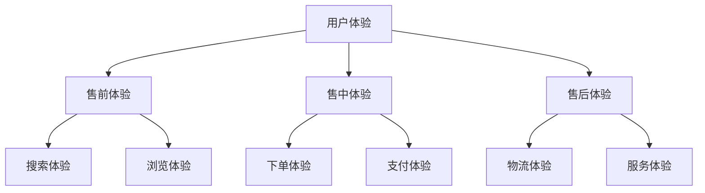

# 图8.46：用户体验评分体系

## 体验维度

```mermaid
flowchart TD
    A[用户体验] --> B[售前体验]
    A --> C[售中体验]
    A --> D[售后体验]
    
    B --> B1[搜索体验]
    B --> B2[浏览体验]
    
    C --> C1[下单体验]
    C --> C2[支付体验]
    
    D --> D1[物流体验]
    D --> D2[服务体验]
```
