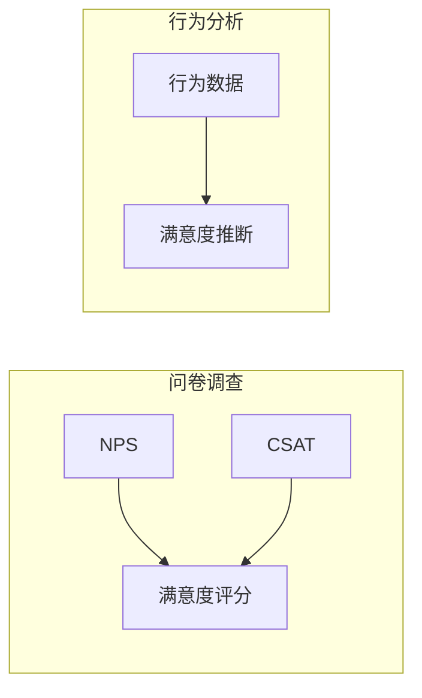
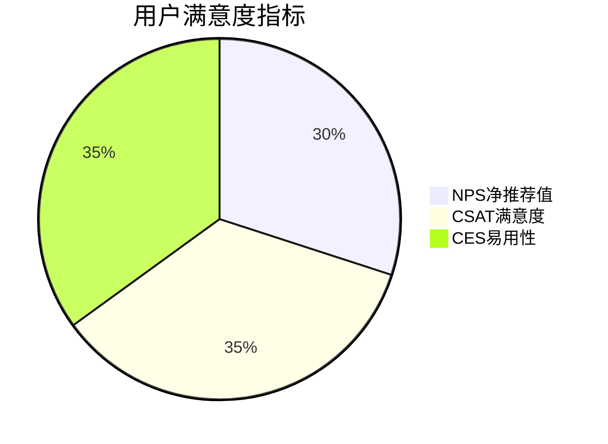

# 图8.47：用户满意度调查

## 调查方法

```mermaid
flowchart LR
    subgraph 问卷调查
        A[NPS] --> D[满意度评分]
        B[CSAT] --> D
    end
    
    subgraph 行为分析
        C[行为数据] --> E[满意度推断]
    end
```

## 指标体系

```mermaid
pie title 用户满意度指标
    "NPS净推荐值" : 30
    "CSAT满意度" : 35
    "CES易用性" : 35
```
