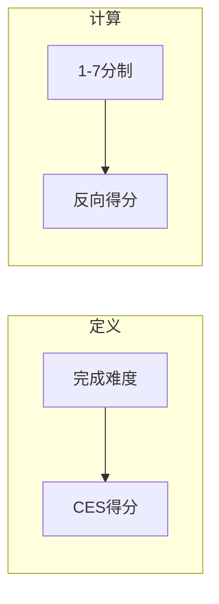
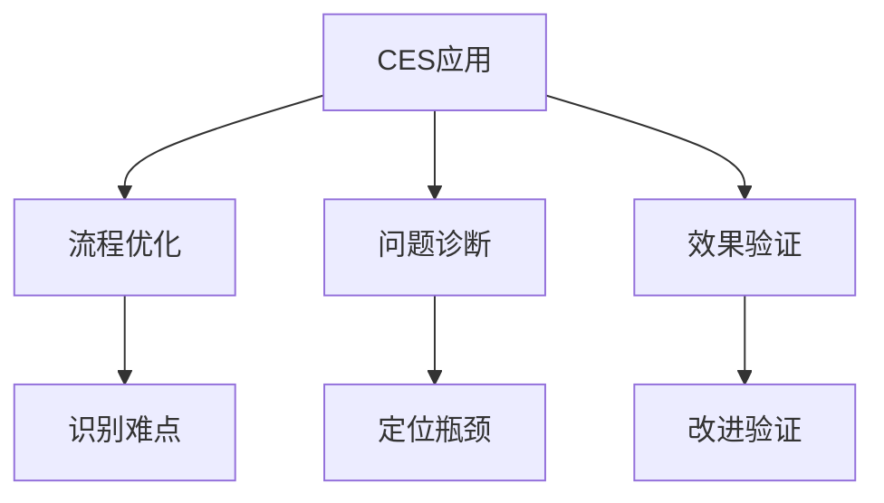

# 图8.48：用户努力度评分

## CES指标

```mermaid
flowchart LR
    subgraph 定义
        A[完成难度] --> D[CES得分]
    end
    
    subgraph 计算
        B[1-7分制] --> E[反向得分]
    end
```

## 评估应用

```mermaid
flowchart TD
    A[CES应用] --> B[流程优化]
    A --> C[问题诊断]
    A --> D[效果验证]
    
    B --> B1[识别难点]
    C --> C1[定位瓶颈]
    D --> D1[改进验证]
```
