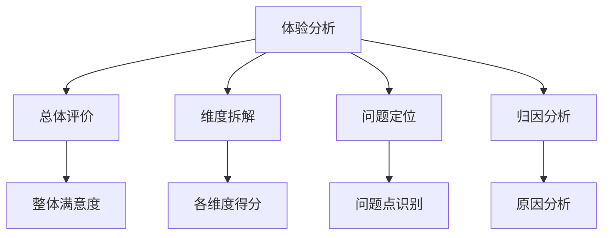
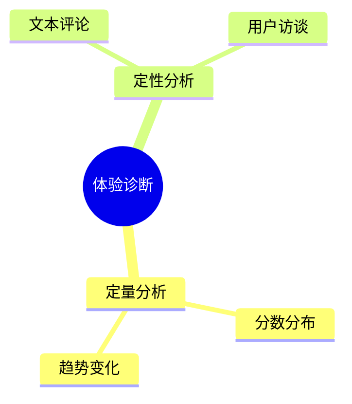

# 图8.49：体验分析与诊断

## 分析框架

```mermaid
flowchart TD
    A[体验分析] --> B[总体评价]
    A --> C[维度拆解]
    A --> D[问题定位]
    A --> E[归因分析]
    
    B --> B1[整体满意度]
    C --> C1[各维度得分]
    D --> D1[问题点识别]
    E --> E1[原因分析]
```

## 诊断方法

```mermaid
mindmap
  root((体验诊断))
    定量分析
      分数分布
      趋势变化
    定性分析
      文本评论
      用户访谈
```
