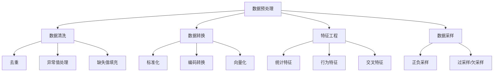

# 图8.4：电商数据预处理

## 数据处理流程

```mermaid
flowchart TD
    A[数据预处理] --> B[数据清洗]
    A --> C[数据转换]
    A --> D[特征工程]
    A --> E[数据采样]
    
    B --> B1[去重]
    B --> B2[异常值处理]
    B --> B3[缺失值填充]
    
    C --> C1[标准化]
    C --> C2[编码转换]
    C --> C3[向量化]
    
    D --> D1[统计特征]
    D --> D2[行为特征]
    D --> D3[交叉特征]
    
    E --> E1[正负采样]
    E --> E2[过采样/欠采样]
```
