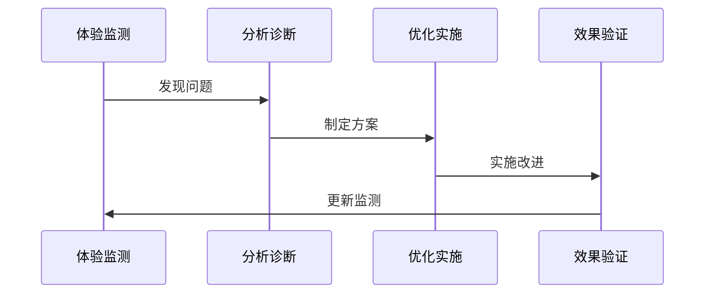
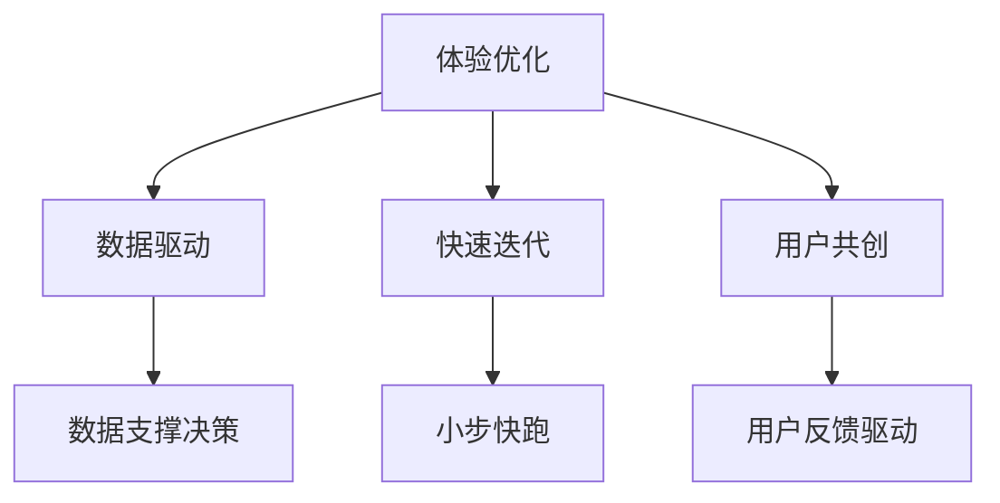

# 图8.50：体验优化闭环

## 优化流程

```mermaid
sequenceDiagram
    participant S as 体验监测
    participant A as 分析诊断
    participant O as 优化实施
    participant V as 效果验证
    
    S->>A: 发现问题
    A->>O: 制定方案
    O->>V: 实施改进
    V->>S: 更新监测
```

## 持续改进

```mermaid
flowchart TD
    A[体验优化] --> B[数据驱动]
    A --> C[快速迭代]
    A --> D[用户共创]
    
    B --> B1[数据支撑决策]
    C --> C1[小步快跑]
    D --> D1[用户反馈驱动]
```
