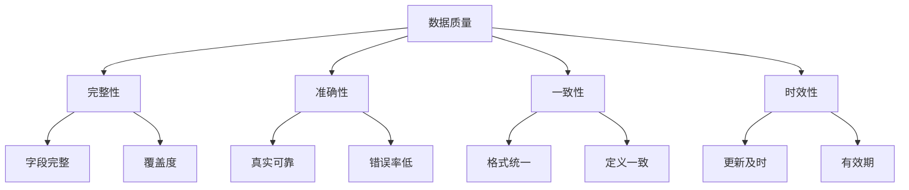
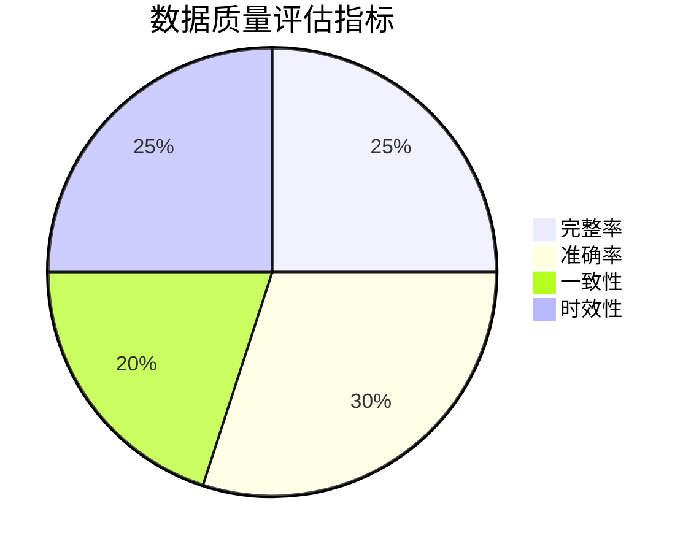

# 图8.5：电商数据质量评估

## 质量维度

```mermaid
flowchart TD
    A[数据质量] --> B[完整性]
    A --> C[准确性]
    A --> D[一致性]
    A --> E[时效性]
    
    B --> B1[字段完整]
    B --> B2[覆盖度]
    
    C --> C1[真实可靠]
    C --> C2[错误率低]
    
    D --> D1[格式统一]
    D --> D2[定义一致]
    
    E --> E1[更新及时]
    E --> E2[有效期]
```

## 质量指标

```mermaid
pie title 数据质量评估指标
    "完整率" : 25
    "准确率" : 30
    "一致性" : 20
    "时效性" : 25
```
