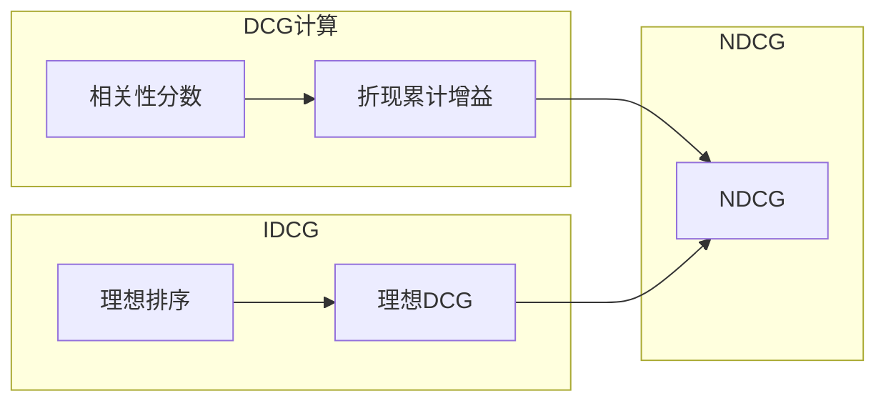

# 图8.6：搜索评测指标——NDCG/DCGM原理

## NDCG原理



## 计算公式

```mermaid
flowchart LR
    subgraph DCG
        A[rel₁/log₂(i+1)] --> D[Σ]
    end
    
    subgraph NDCG
        B[DCG/IDCG] --> E[0-1标准化]
    end
```
