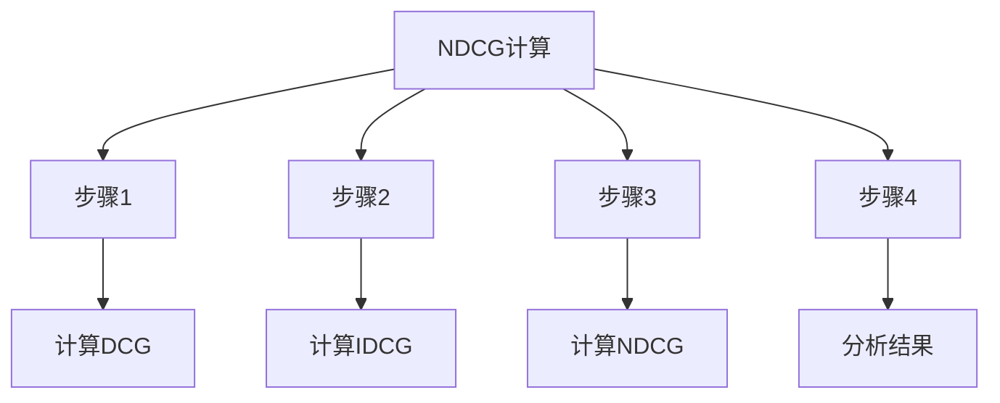
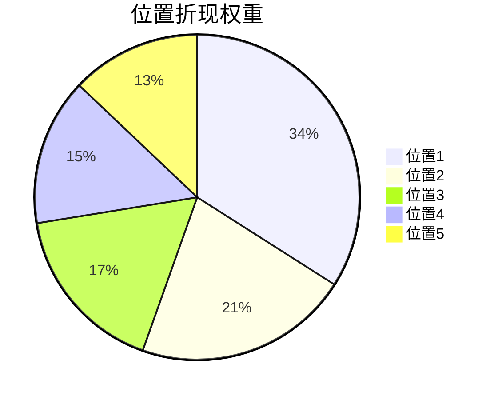

# 图8.7：NDCG计算示例

## 计算示例

```mermaid
flowchart TD
    A[NDCG计算] --> B[步骤1]
    A --> C[步骤2]
    A --> D[步骤3]
    A --> E[步骤4]
    
    B --> B1[计算DCG]
    C --> C1[计算IDCG]
    D --> D1[计算NDCG]
    E --> E1[分析结果]
```

## 不同位置权重

```mermaid
pie title 位置折现权重
    "位置1" : 100
    "位置2" : 63
    "位置3" : 50
    "位置4" : 43
    "位置5" : 38
```
