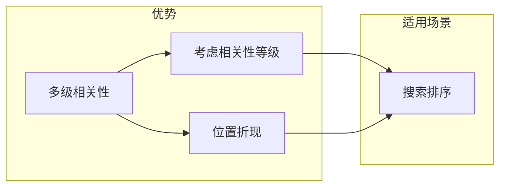
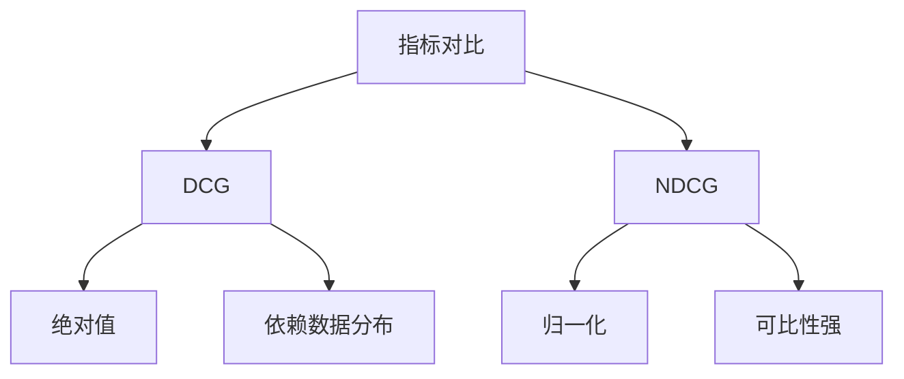

# 图8.8：DCGM指标详解

## DCGM特点

```mermaid
flowchart LR
    subgraph 优势
        A[多级相关性] --> D[考虑相关性等级]
        A --> E[位置折现]
    end
    
    subgraph 适用场景
        D --> G[搜索排序]
        E --> G
    end
```

## 与NDCG对比

```mermaid
flowchart TD
    A[指标对比] --> B[DCG]
    A --> C[NDCG]
    
    B --> B1[绝对值]
    B --> B2[依赖数据分布]
    
    C --> C1[归一化]
    C --> C2[可比性强]
```
