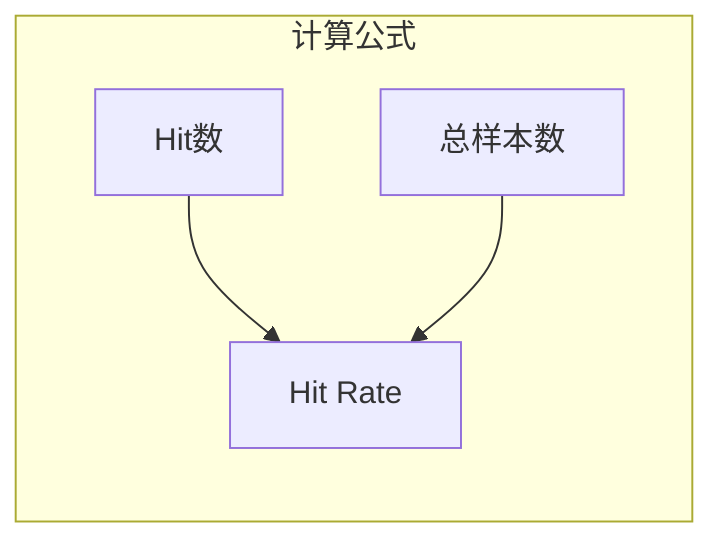
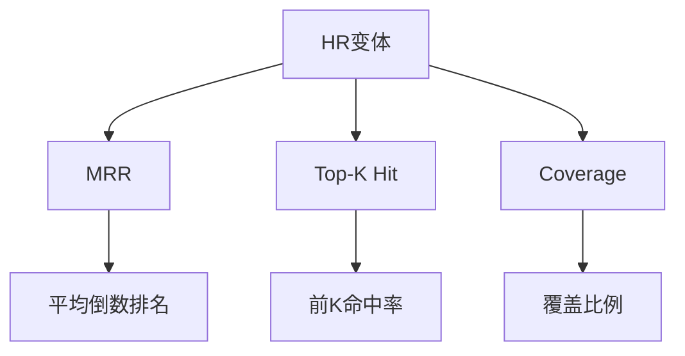

# 图8.9：Hit Rate指标

## Hit Rate定义

```mermaid
flowchart LR
    subgraph 计算公式
        A[Hit数] --> D[Hit Rate]
        B[总样本数] --> D
    end
```

## 变体指标

```mermaid
flowchart TD
    A[HR变体] --> B[MRR]
    A --> C[Top-K Hit]
    A --> D[Coverage]
    
    B --> B1[平均倒数排名]
    C --> C1[前K命中率]
    D --> D1[覆盖比例]
```
