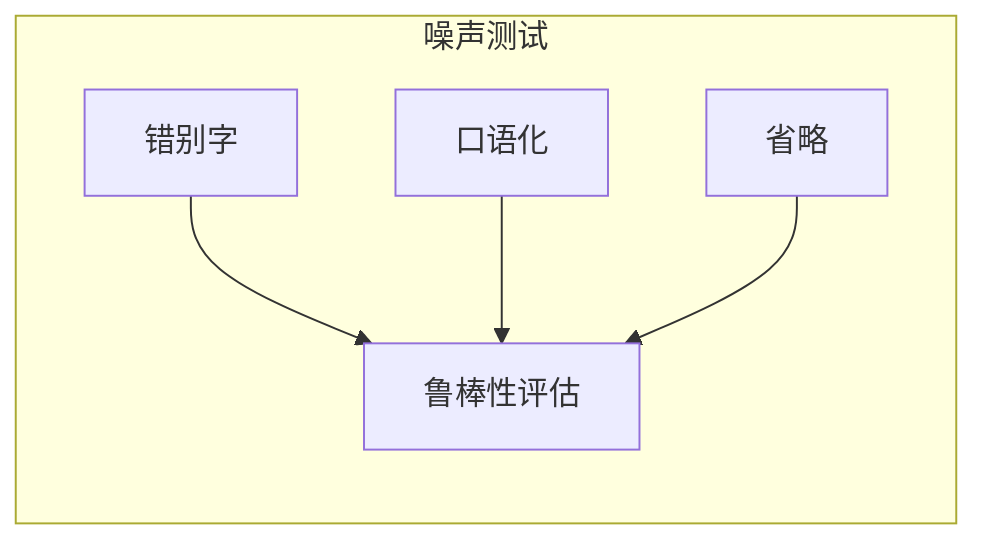
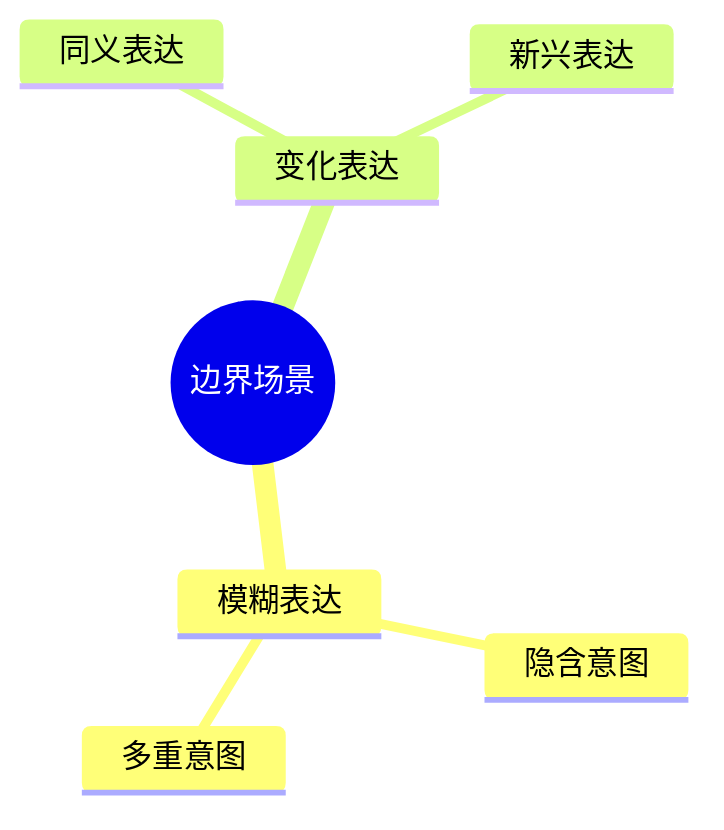

# 图9.3：意图检测鲁棒性

## 鲁棒性测试

```mermaid
flowchart LR
    subgraph 噪声测试
        A[错别字] --> D[鲁棒性评估]
        B[口语化] --> D
        C[省略] --> D
    end
```

## 边界case

```mermaid
mindmap
  root((边界场景))
    模糊表达
      隐含意图
      多重意图
    变化表达
      同义表达
      新兴表达
```
