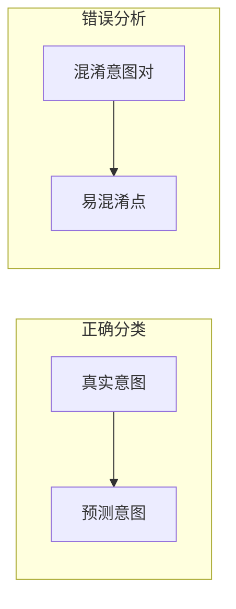
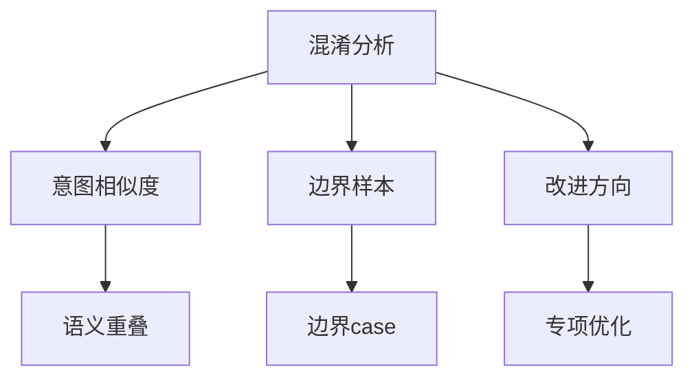

# 图9.4：意图混淆分析

## 混淆矩阵

```mermaid
flowchart LR
    subgraph 正确分类
        A[真实意图] --> D[预测意图]
    end
    
    subgraph 错误分析
        B[混淆意图对] --> E[易混淆点]
    end
```

## 分析方法

```mermaid
flowchart TD
    A[混淆分析] --> B[意图相似度]
    A --> C[边界样本]
    A --> D[改进方向]
    
    B --> B1[语义重叠]
    C --> C1[边界case]
    D --> D2[专项优化]
```
