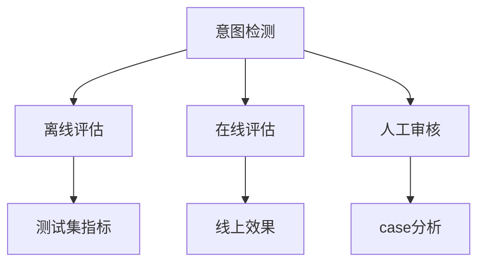
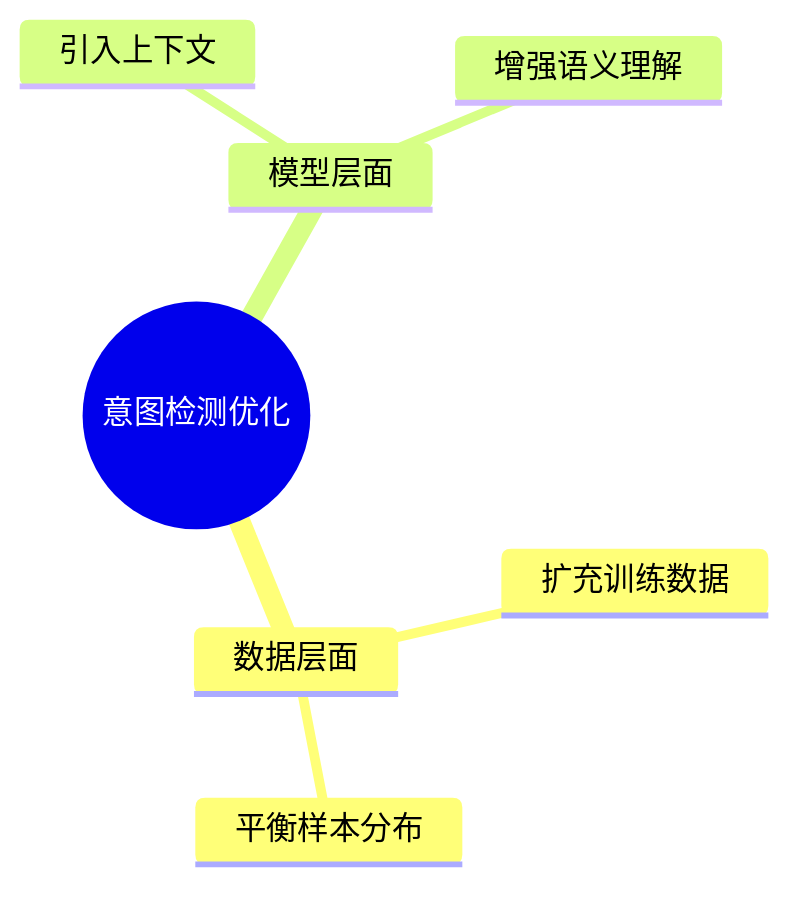

# 图9.5：意图检测综合评估

## 评估框架

```mermaid
flowchart TD
    A[意图检测] --> B[离线评估]
    A --> C[在线评估]
    A --> D[人工审核]
    
    B --> B1[测试集指标]
    C --> C1[线上效果]
    D --> D1[case分析]
```

## 优化建议

```mermaid
mindmap
  root((意图检测优化))
    数据层面
      扩充训练数据
      平衡样本分布
    模型层面
      引入上下文
      增强语义理解
```
