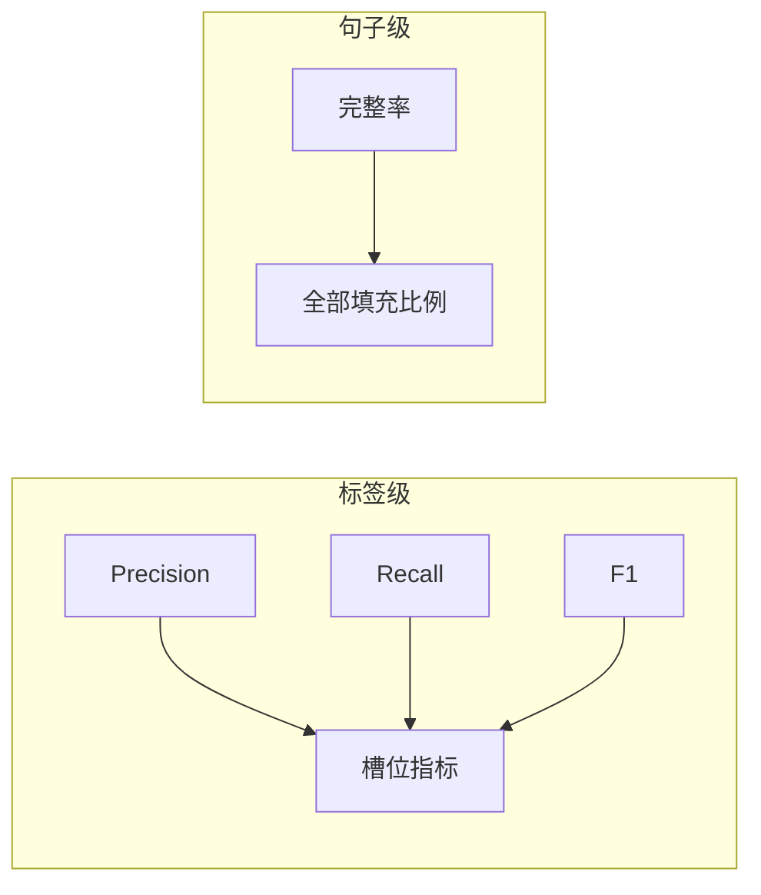
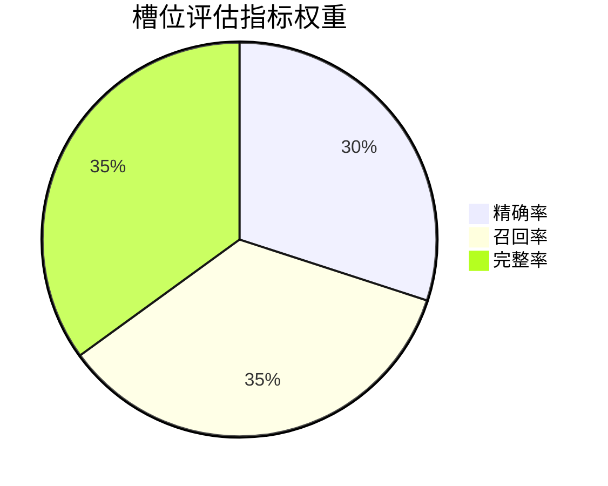

# 图9.7：槽位填充指标

## 评估指标

```mermaid
flowchart LR
    subgraph 标签级
        A[Precision] --> D[槽位指标]
        B[Recall] --> D
        C[F1] --> D
    end
    
    subgraph 句子级
        D1[完整率] --> E[全部填充比例]
    end
```

## 计算方式

```mermaid
pie title 槽位评估指标权重
    "精确率" : 30
    "召回率" : 35
    "完整率" : 35
```
