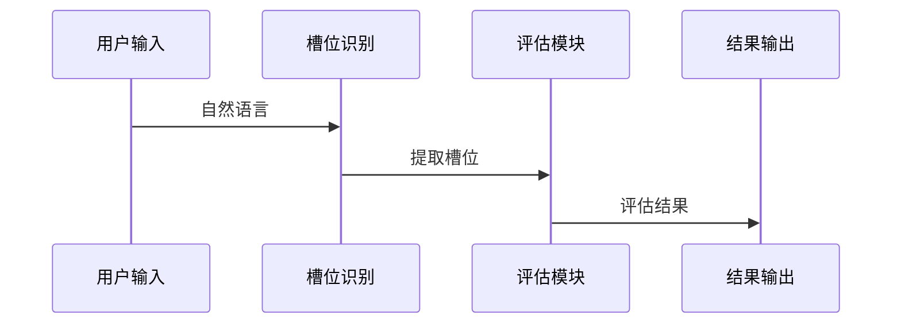
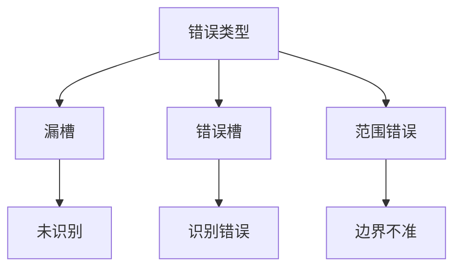

# 图9.8：槽位评估方法

## 评估流程

```mermaid
sequenceDiagram
    participant U as 用户输入
    participant N as 槽位识别
    participant E as 评估模块
    participant R as 结果输出
    
    U->>N: 自然语言
    N->>E: 提取槽位
    E->>R: 评估结果
```

## 错误分析

```mermaid
flowchart TD
    A[错误类型] --> B[漏槽]
    A --> C[错误槽]
    A --> D[范围错误]
    
    B --> B1[未识别]
    C --> C1[识别错误]
    D --> D1[边界不准]
```
