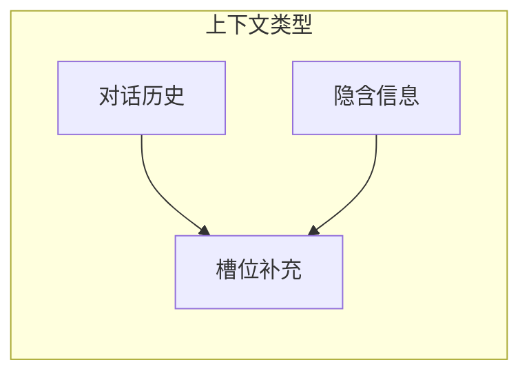
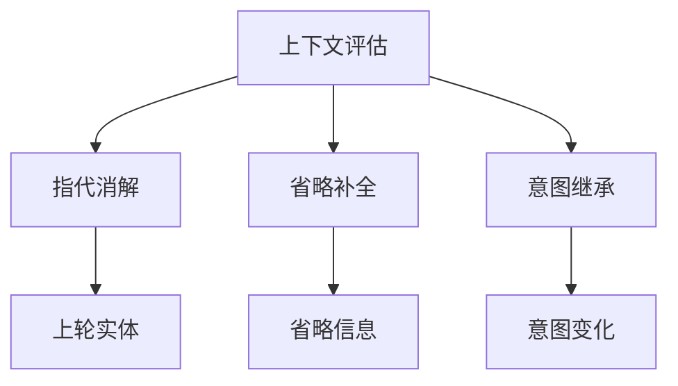

# 图9.9：上下文槽位填充

## 上下文依赖

```mermaid
flowchart LR
    subgraph 上下文类型
        A[对话历史] --> D[槽位补充]
        B[隐含信息] --> D
    end
```

## 评估要点

```mermaid
flowchart TD
    A[上下文评估] --> B[指代消解]
    A --> C[省略补全]
    A --> D[意图继承]
    
    B --> B1[上轮实体]
    C --> C1[省略信息]
    D --> D2[意图变化]
```
