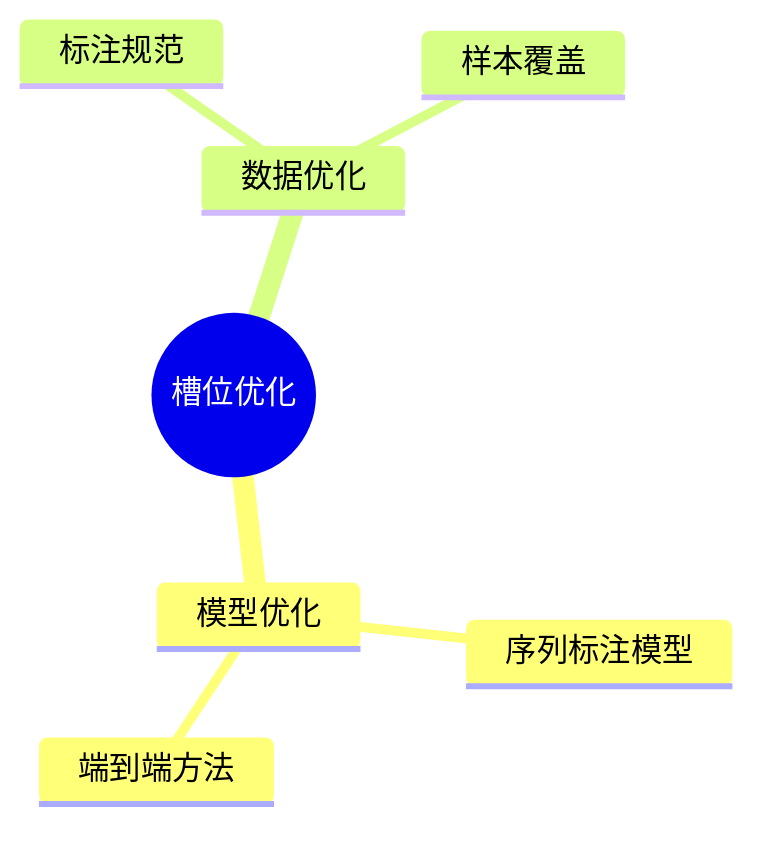
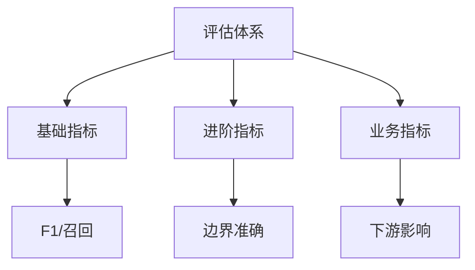

# 图9.10：槽位填充优化

## 优化方向

```mermaid
mindmap
  root((槽位优化))
    模型优化
      序列标注模型
      端到端方法
    数据优化
      标注规范
      样本覆盖
```

## 评估体系

```mermaid
flowchart TD
    A[评估体系] --> B[基础指标]
    A --> C[进阶指标]
    A --> D[业务指标]
    
    B --> B1[F1/召回]
    C --> C1[边界准确]
    D --> D2[下游影响]
```
