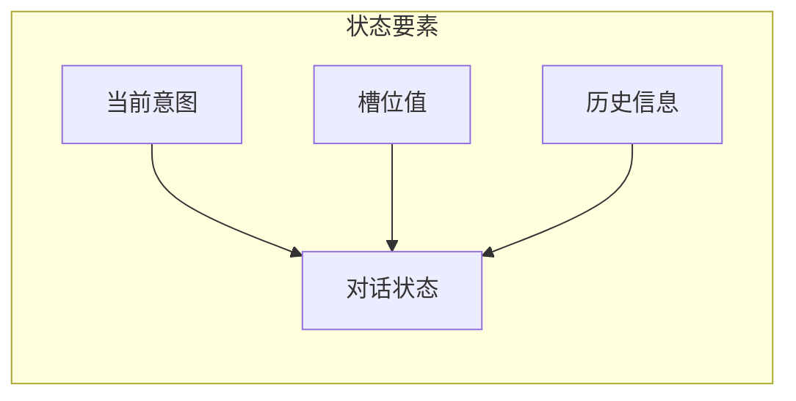
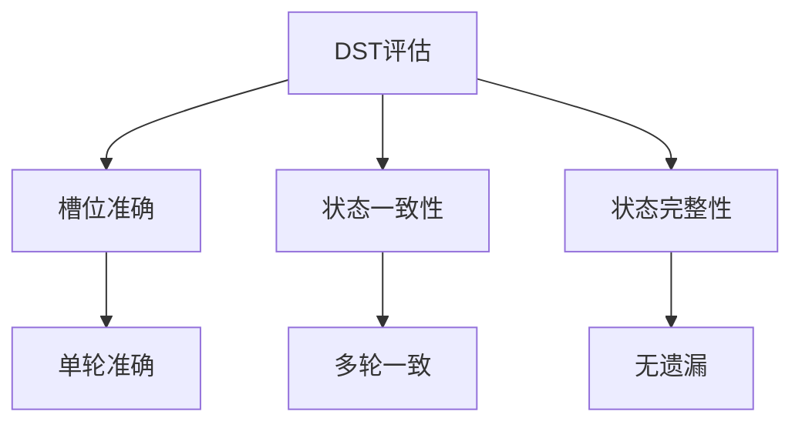

# 图9.11：对话状态追踪评估

## DST任务

```mermaid
flowchart LR
    subgraph 状态要素
        A[当前意图] --> D[对话状态]
        B[槽位值] --> D
        C[历史信息] --> D
    end
```

## 评估维度

```mermaid
flowchart TD
    A[DST评估] --> B[槽位准确]
    A --> C[状态一致性]
    A --> D[状态完整性]
    
    B --> B1[单轮准确]
    C --> C1[多轮一致]
    D --> D2[无遗漏]
```
