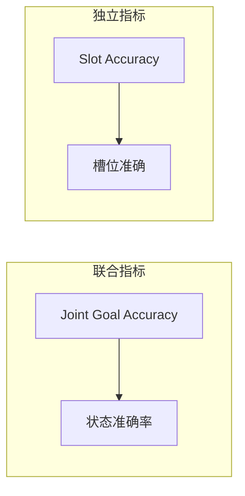
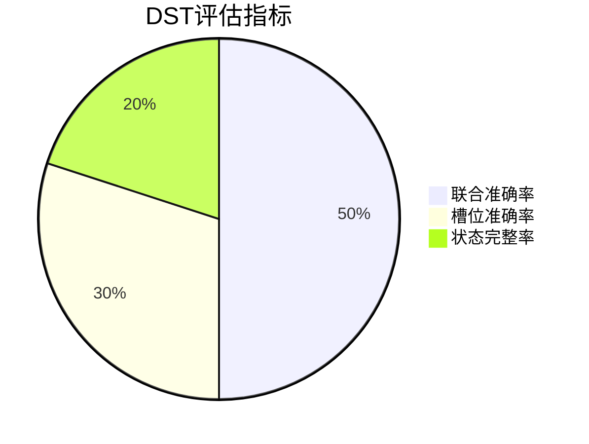

# 图9.12：状态追踪指标

## 评估指标

```mermaid
flowchart LR
    subgraph 联合指标
        A[Joint Goal Accuracy] --> D[状态准确率]
    end
    
    subgraph 独立指标
        B[Slot Accuracy] --> E[槽位准确]
    end
```

## 计算方法

```mermaid
pie title DST评估指标
    "联合准确率" : 50
    "槽位准确率" : 30
    "状态完整率" : 20
```
