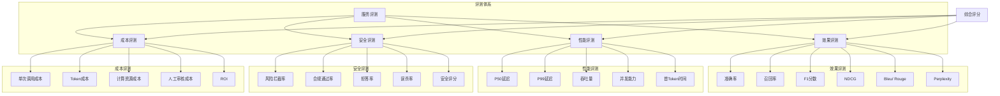
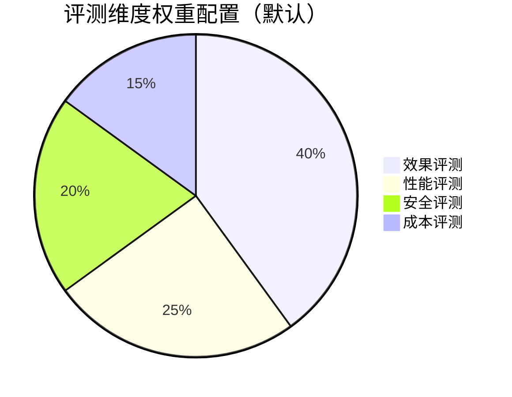

# 图9.1：服务评测指标体系

## 评测维度与指标设计

本章介绍了完整的服务评测指标体系，涵盖效果、性能、安全、成本四大维度：

| 维度 | 核心指标 | 衡量目标 |
|------|---------|----------|
| 效果 | 准确率、召回率、F1、NDCG | 模型输出质量 |
| 性能 | 延迟、吞吐量、并发数 | 响应能力 |
| 安全 | 风险拦截率、合规通过率 | 内容安全 |
| 成本 | 单次调用成本、ROI | 商业可行性 |

## 指标权重配置

