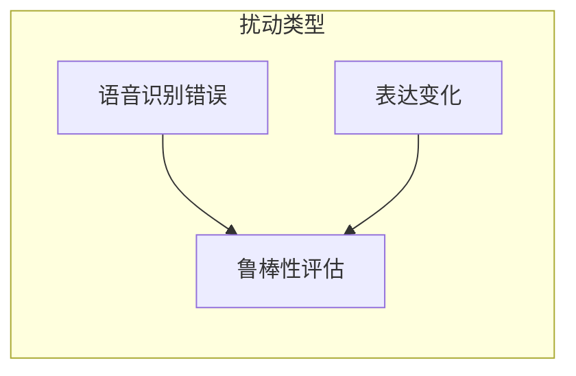
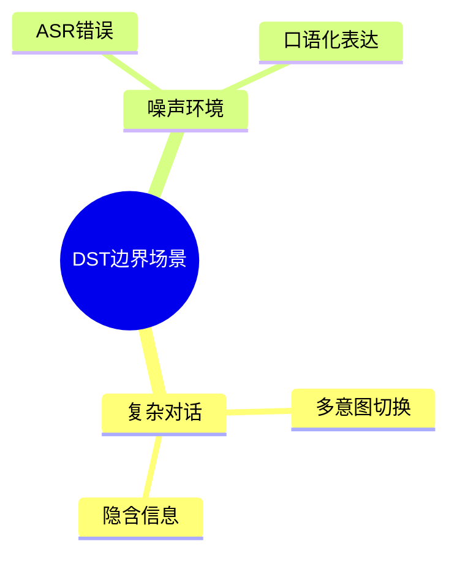

# 图9.13：DST鲁棒性评估

## 鲁棒性测试

```mermaid
flowchart LR
    subgraph 扰动类型
        A[语音识别错误] --> D[鲁棒性评估]
        B[表达变化] --> D
    end
```

## 边界场景

```mermaid
mindmap
  root((DST边界场景))
    复杂对话
      多意图切换
      隐含信息
    噪声环境
      ASR错误
      口语化表达
```
