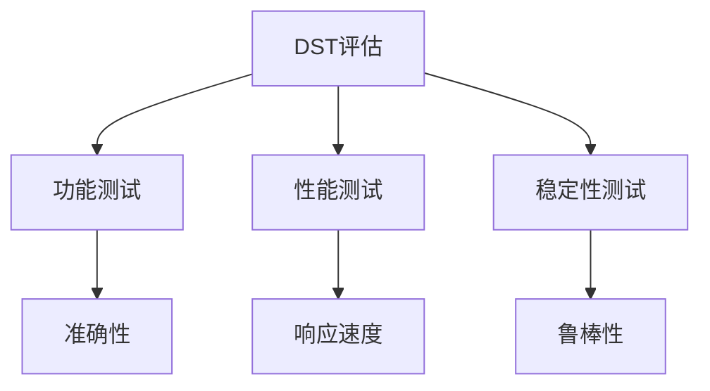
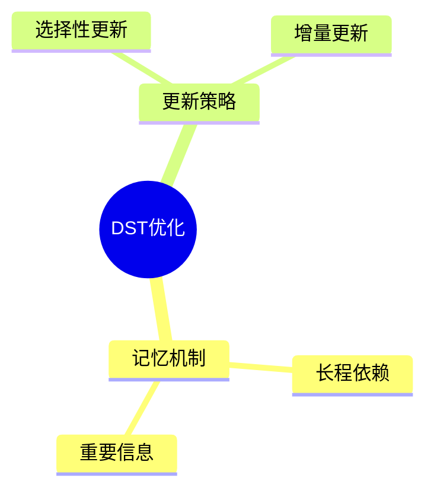

# 图9.15：DST综合评估框架

## 评估框架

```mermaid
flowchart TD
    A[DST评估] --> B[功能测试]
    A --> C[性能测试]
    A --> D[稳定性测试]
    
    B --> B1[准确性]
    C --> C1[响应速度]
    D --> D1[鲁棒性]
```

## 优化策略

```mermaid
mindmap
  root((DST优化))
    记忆机制
      长程依赖
      重要信息
    更新策略
      选择性更新
      增量更新
```
