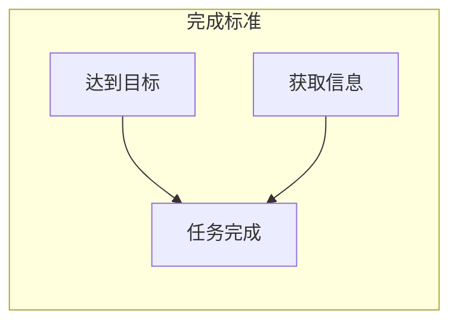
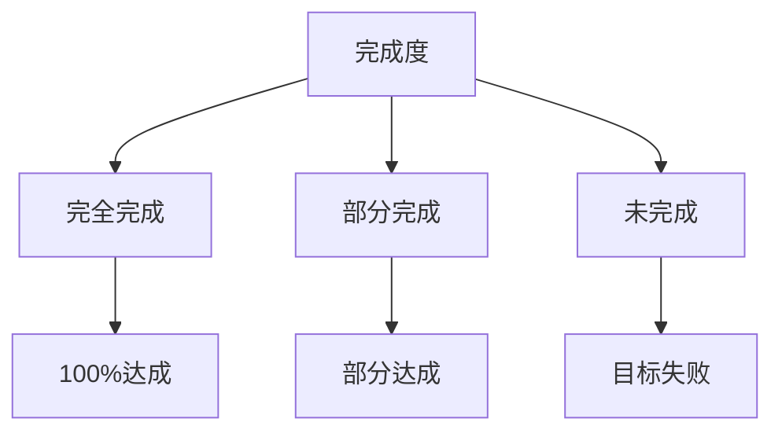

# 图9.16：任务完成率评估

## 完成定义

```mermaid
flowchart LR
    subgraph 完成标准
        A[达到目标] --> D[任务完成]
        B[获取信息] --> D
    end
```

## 评估级别

```mermaid
flowchart TD
    A[完成度] --> B[完全完成]
    A --> C[部分完成]
    A --> D[未完成]
    
    B --> B1[100%达成]
    C --> C1[部分达成]
    D --> D1[目标失败]
```
