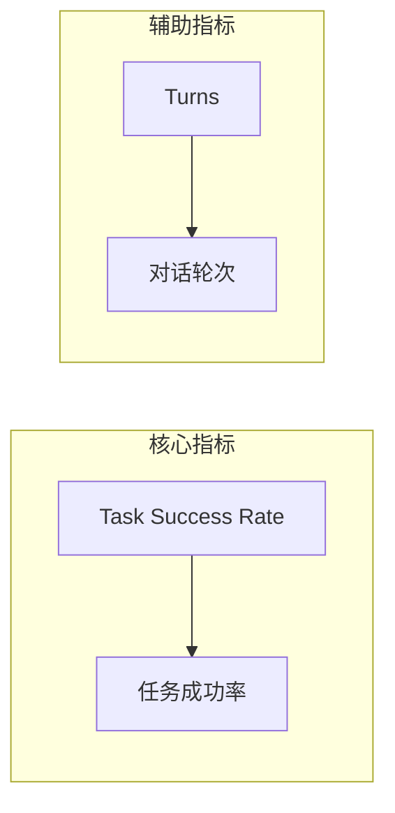
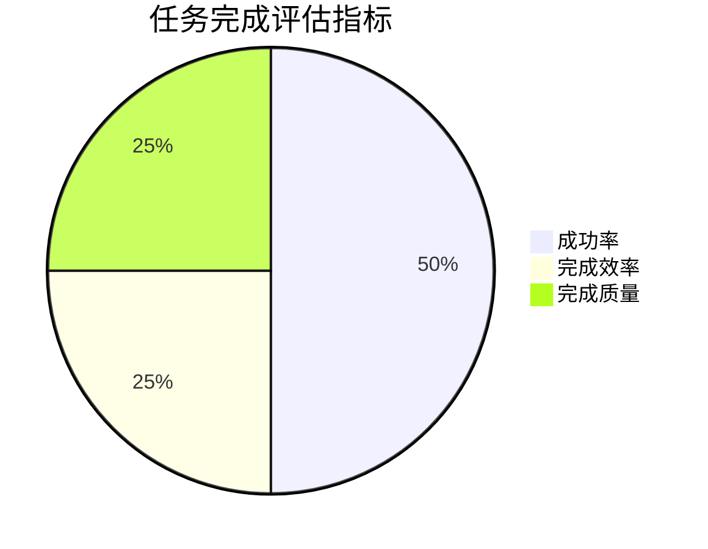

# 图9.17：完成率指标

## 指标体系

```mermaid
flowchart LR
    subgraph 核心指标
        A[Task Success Rate] --> D[任务成功率]
    end
    
    subgraph 辅助指标
        B[Turns] --> E[对话轮次]
    end
```

## 计算方法

```mermaid
pie title 任务完成评估指标
    "成功率" : 50
    "完成效率" : 25
    "完成质量" : 25
```
