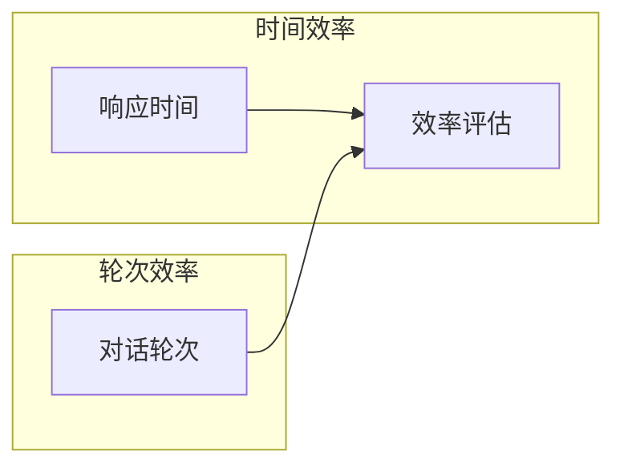
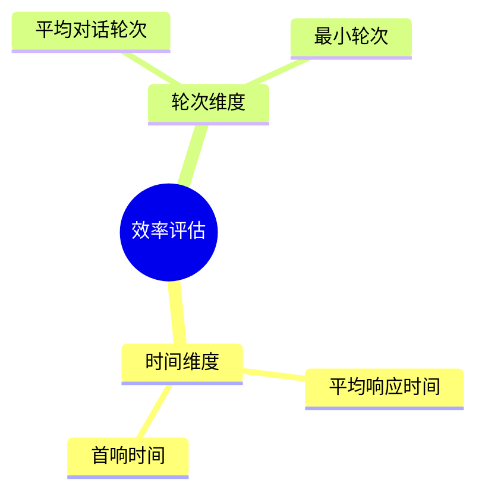

# 图9.19：任务效率评估

## 效率指标

```mermaid
flowchart LR
    subgraph 时间效率
        A[响应时间] --> D[效率评估]
    end
    
    subgraph 轮次效率
        B[对话轮次] --> D
    end
```

## 评估标准

```mermaid
mindmap
  root((效率评估))
    时间维度
      平均响应时间
      首响时间
    轮次维度
      平均对话轮次
      最小轮次
```
