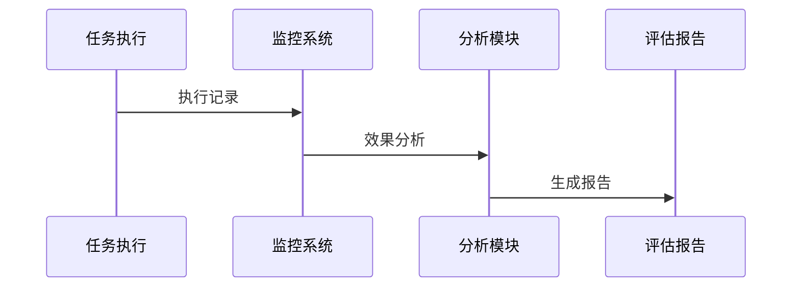
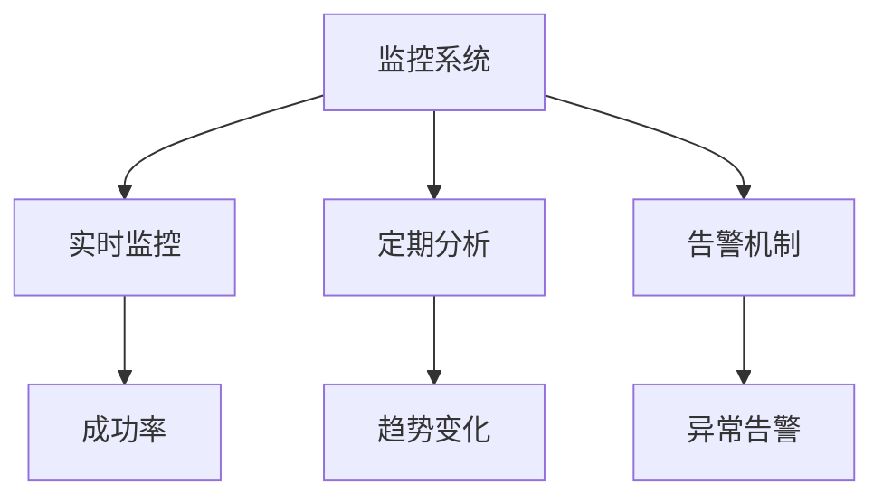

# 图9.20：完成率评估系统

## 评估流程

```mermaid
sequenceDiagram
    participant T as 任务执行
    participant M as 监控系统
    participant A as 分析模块
    participant R as 评估报告
    
    T->>M: 执行记录
    M->>A: 效果分析
    A->>R: 生成报告
```

## 监控体系

```mermaid
flowchart TD
    A[监控系统] --> B[实时监控]
    A --> C[定期分析]
    A --> D[告警机制]
    
    B --> B1[成功率]
    C --> C1[趋势变化]
    D --> D2[异常告警]
```
