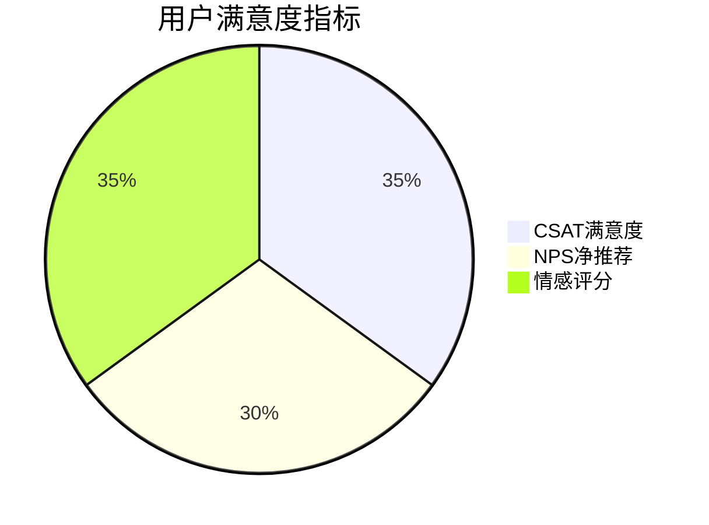
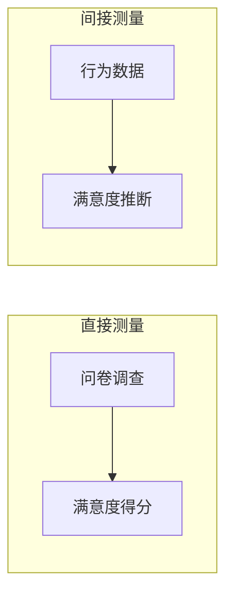

# 图9.22：满意度指标

## 评估指标

```mermaid
pie title 用户满意度指标
    "CSAT满意度" : 35
    "NPS净推荐" : 30
    "情感评分" : 35
```

## 测量方法

```mermaid
flowchart LR
    subgraph 直接测量
        A[问卷调查] --> D[满意度得分]
    end
    
    subgraph 间接测量
        B[行为数据] --> E[满意度推断]
    end
```
