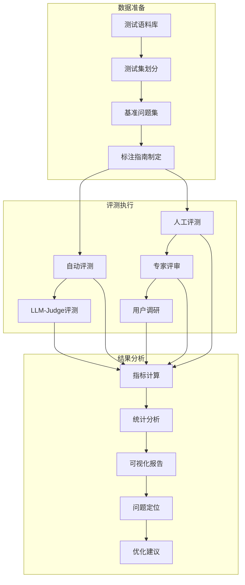

# 图9.2：对话评测流程

## 完整评测Pipeline

对话评测流程包含数据准备、评测执行、结果分析三个阶段：



## 多维度评测指标

```mermaid
flowchart LR
    subgraph 维度一：相关性
        A1[语义相关性] --> A2[主题一致性] --> A3[意图匹配度]
    end
    
    subgraph 维度二：流畅性
        B1[语法正确性] --> B2[表达自然度] --> B3[连贯性]
    end
    
    subgraph 维度三：信息量
        C1[内容完整性] --> C2[细节丰富度] --> C3[准确性]
    end
    
    subgraph 维度四：安全性
        D1[风险检测] --> D2[合规检查] --> D3[毒性过滤]
    end
```
