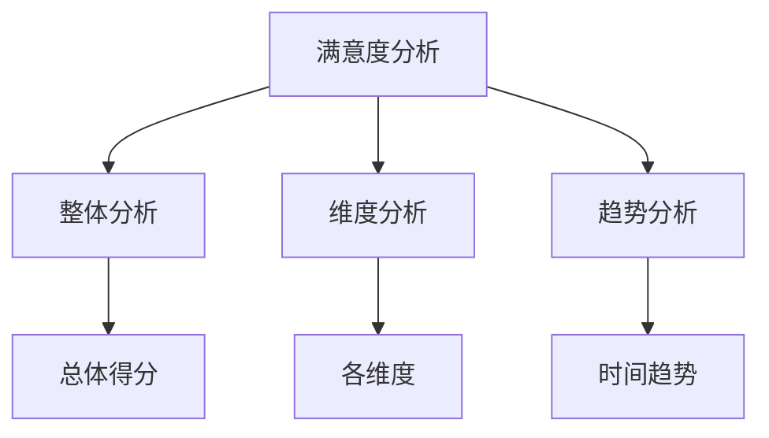
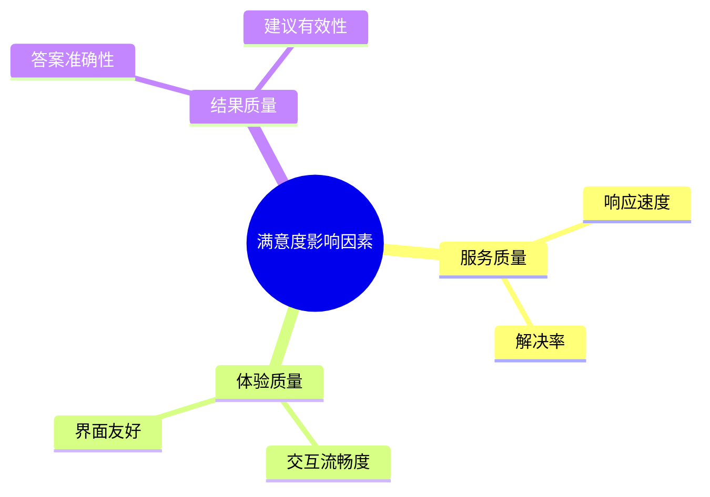

# 图9.23：满意度分析

## 分析方法

```mermaid
flowchart TD
    A[满意度分析] --> B[整体分析]
    A --> C[维度分析]
    A --> D[趋势分析]
    
    B --> B1[总体得分]
    C --> C1[各维度]
    D --> D1[时间趋势]
```

## 影响因素

```mermaid
mindmap
  root((满意度影响因素))
    服务质量
      响应速度
      解决率
    体验质量
      交互流畅度
      界面友好
    结果质量
      答案准确性
      建议有效性
```
