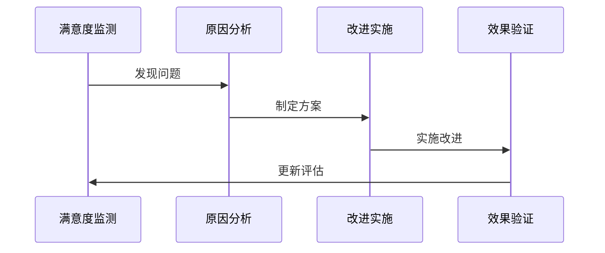

# 图9.24：满意度改进

## 改进流程

```mermaid
sequenceDiagram
    participant S as 满意度监测
    participant A as 原因分析
    participant I as 改进实施
    participant V as 效果验证
    
    S->>A: 发现问题
    A->>I: 制定方案
    I->>V: 实施改进
    V->>S: 更新评估
```
