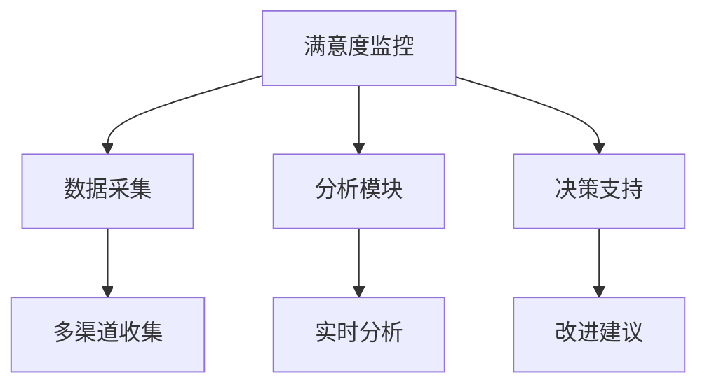
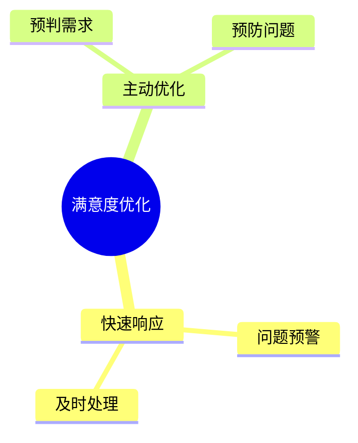

# 图9.25：满意度监控体系

## 监控架构

```mermaid
flowchart TD
    A[满意度监控] --> B[数据采集]
    A --> C[分析模块]
    A --> D[决策支持]
    
    B --> B1[多渠道收集]
    C --> C1[实时分析]
    D --> D1[改进建议]
```

## 持续优化

```mermaid
mindmap
  root((满意度优化))
    快速响应
      问题预警
      及时处理
    主动优化
      预判需求
      预防问题
```
