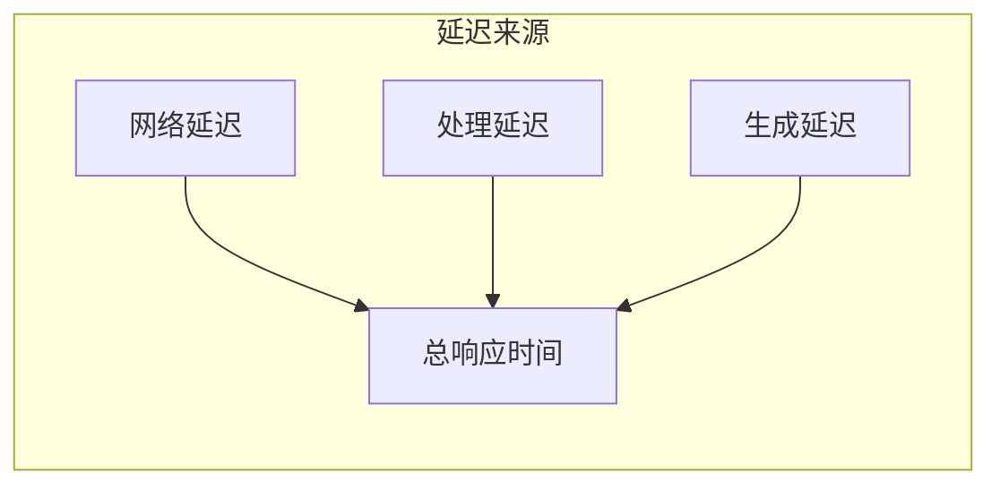
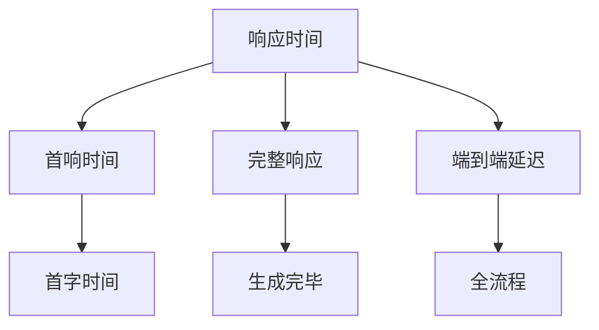

# 图9.26：响应时间评估

## 响应时间组成

```mermaid
flowchart LR
    subgraph 延迟来源
        A[网络延迟] --> D[总响应时间]
        B[处理延迟] --> D
        C[生成延迟] --> D
    end
```

## 评估维度

```mermaid
flowchart TD
    A[响应时间] --> B[首响时间]
    A --> C[完整响应]
    A --> D[端到端延迟]
    
    B --> B1[首字时间]
    C --> C1[生成完毕]
    D --> D2[全流程]
```
