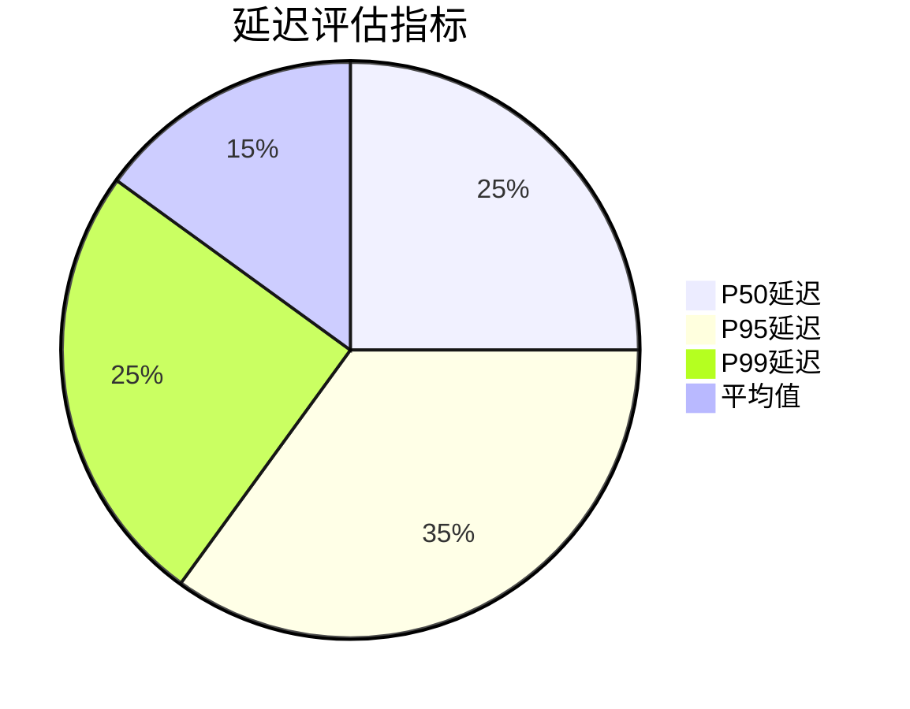
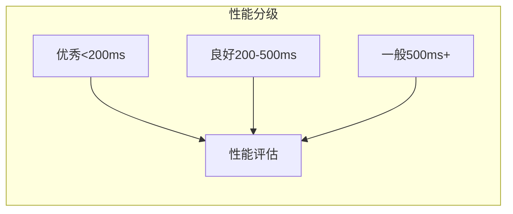

# 图9.27：延迟指标

## 统计指标

```mermaid
pie title 延迟评估指标
    "P50延迟" : 25
    "P95延迟" : 35
    "P99延迟" : 25
    "平均值" : 15
```

## 评估标准

```mermaid
flowchart LR
    subgraph 性能分级
        A[优秀<200ms] --> D[性能评估]
        B[良好200-500ms] --> D
        C[一般500ms+ ] --> D
    end
```
