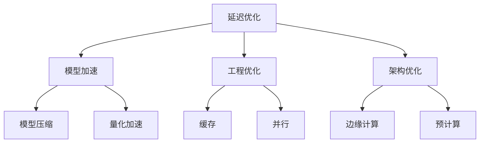

# 图9.28：延迟优化

## 优化方向

```mermaid
flowchart TD
    A[延迟优化] --> B[模型加速]
    A --> C[工程优化]
    A --> D[架构优化]
    
    B --> B1[模型压缩]
    B --> B2[量化加速]
    
    C --> C1[缓存]
    C --> C2[并行]
    
    D --> D1[边缘计算]
    D --> D2[预计算]
```
