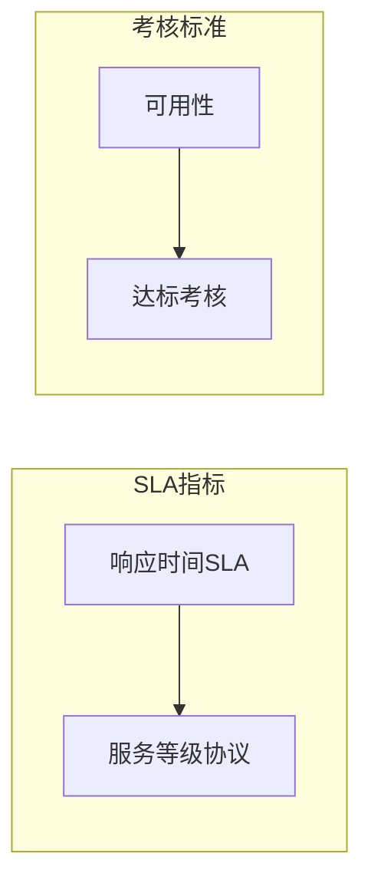
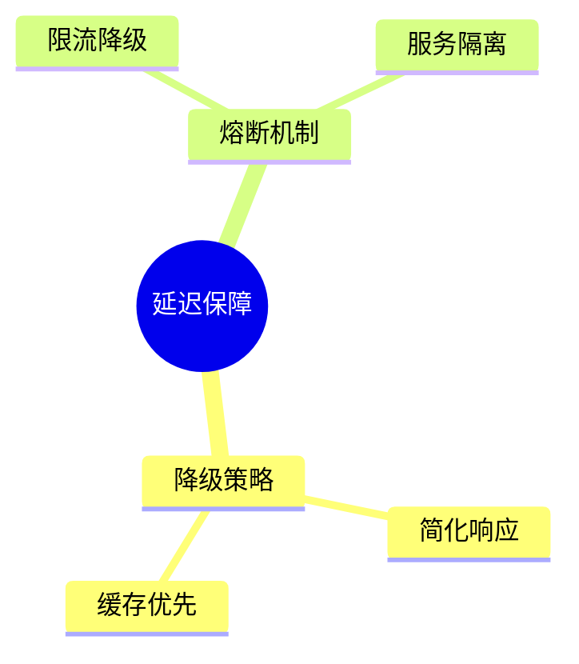

# 图9.30：延迟SLA管理

## SLA标准

```mermaid
flowchart LR
    subgraph SLA指标
        A[响应时间SLA] --> D[服务等级协议]
    end
    
    subgraph 考核标准
        B[可用性] --> E[达标考核]
    end
```

## 保障机制

```mermaid
mindmap
  root((延迟保障))
    降级策略
      简化响应
      缓存优先
    熔断机制
      限流降级
      服务隔离
```
