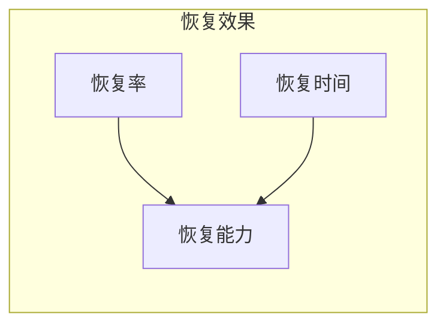
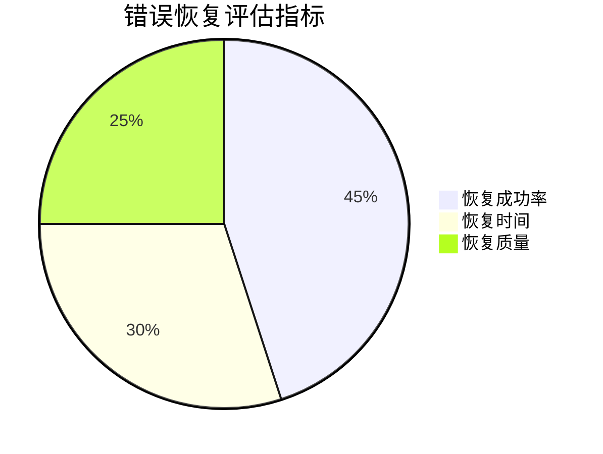

# 图9.32：恢复能力指标

## 评估指标

```mermaid
flowchart LR
    subgraph 恢复效果
        A[恢复率] --> D[恢复能力]
        B[恢复时间] --> D
    end
```

## 评估方法

```mermaid
pie title 错误恢复评估指标
    "恢复成功率" : 45
    "恢复时间" : 30
    "恢复质量" : 25
```
